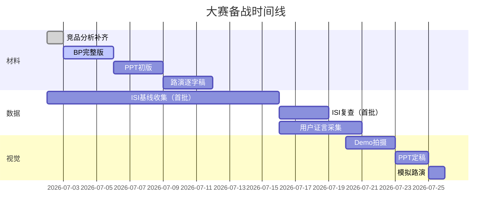

# 大赛材料准备清单

## 优先级 P0（必须做）

- [ ] **竞品分析** ✅ 已输出草稿（01_竞品分析.md）
- [ ] **商业计划书** ✅ 已输出骨架（02_商业计划书.md）
- [ ] **Demo 视频** ✅ 已输出脚本（03_Demo脚本.md）
- [ ] **BP 完整版** — 在骨架基础上填入真实财务/团队信息
- [ ] **10 页路演 PPT** — 把 BP 浓缩成 PPT

## 优先级 P1（2 周内做）

- [ ] **竞品数据补齐** — 用浏览器搜索补全竞品估值/融资数据
- [ ] **团队故事** — 需要至尊宝确定参赛身份（个人/团队？）
- [ ] **ISI 基线数据收集** — 等前端发版后 2 周积累
- [ ] **用户证言** — 找到 2-3 个愿意出面的早期用户

## 优先级 P2（1 个月内）

- [ ] **财务模型细化** — 基于实际 API 成本、获客数据做推演
- [ ] **路演练习稿** — 12 分钟逐字稿
- [ ] **附录材料** — 技术白皮书（世界模型详解）、合规文档
- [ ] **设计优化** — Demo 视频拍摄/剪辑

## 时间线

